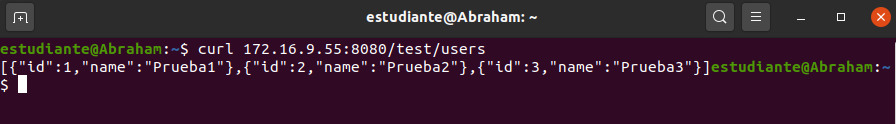

## Creación del servidor y test de conexión.
-----

### **1. Creación del proyecto en Spring Tool Suite**

Para la creación del proyecto en Spring Tool Suite usaré la herramienta de Spring Starter Project, en el que me pide el nombre del proyecto, artifact, version de Java, tipo de proyecto, descripción, etc...


### **2. Creación de una entidad**

Para empezar el proyecto y probar las conexiones a la API REST desde otros equipos en la red local, el primer paso es crear una entidad.

La entidad creada es `User` la cual tiene dos atributos, `id` y `name`, también tiene los *constructores, getters y setters por defecto*

### **3. Creación de un controlador y el end point**

El controlador `UserController` contiene un `ArrayList` de `Users` para simular la persistencia.

Contiene dos endpoints, un `GET` y un `POST`

El primero devuelve todos los usuarios y no recibe nada, mientras que el `POST` recibe un User como `RequestBody` y devuelve el usuario recibido.

### **4. Editando el archivo `application.properties`**

En el archivo debemos incluir dos líneas para decirle a Spring en que puerto debe escuchar y en que ip se debe montar para evitar que se monte en localhost (por defecto).

Debe quedar así:
```yml
server.port=8080
server.address=172.16.9.55
```

### **5. Test de conexión**

Para probar que se puede acceder al servidor un compañero desde otro equipo hizo una petición `GET` como se puede ver en la imagen:




